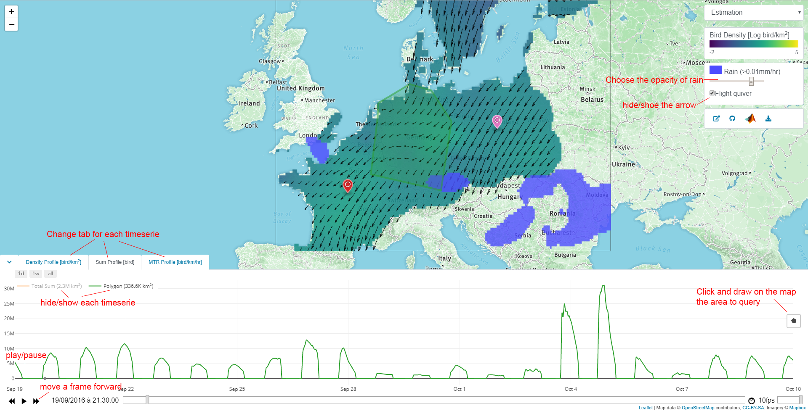

# BMM-web

This code is for building the [website (bmm.raphaelnussbaumer.com)](https://bmm.raphaelnussbaumer.com/) used to visualize the result of [BMM](https://rafnuss-postdoc.github.io/BMM/).

## Description


### Layers
The map can displays the following layers: 
* the rain as a blue mask (turn on/off with checkbox). 
* bird flight speed and direction as arrow (turn on/off with checkbox). 
* the bird density with as colored map.

These layers are animated with the time control on the bottom of the screen which allows for pausing, changing the speed, or moving a frame at the time. 

### Timeseries
In addition, 3 timeseries are available (collaped by default) on the bottom of the screen, just above the timecontrol. 
* The first one displays the bird density at a single location, 
* The second the sum of all bird present in an area 
* The third the mean bird traffic (MTR) perpendicular to a transect. 

For each of them, a drawing button positined on the right of the time series allows to query on the map the corresponding point, area or line. 

## Packaged used
[leaflet](https://leafletjs.com/) is used manage the map and various layer, [Leaflet.TimeDimension](https://github.com/socib/Leaflet.TimeDimension) controls the time and interaction with the layer. The data query on the time series are served by [Nodejs](https://nodejs.org/) and stoed by [Mongodb](https://www.mongodb.com/). 


## How to use the API

### marker_density

Query the bird density [bird/km^2] at a location defined by its coordinates (lat, lng). 
```
https://bmm.raphaelnussbaumer.com/api/marker_density/{{lat}},{{lng}}
```
Exemple:
```
https://bmm.raphaelnussbaumer.com/api/marker_density/60.58696734225869,14.941406250000002
```
The return a json dataset containing the estimated density `density.est` togethuer with the 10 and 90th quantile `density.q10` and `density.e90`. The same query also return the north-south and east-west flight vector as `u` and `v` respectively. Each data return a vector of size ... 
```
{
  "density": {
      "est": [],
      "q10": [],
      "q90": [],
  },
  "u": [],
  "v": [],
}
```


### Sum of bird over an area
```
https://bmm.raphaelnussbaumer.com/api/polygon_sum/{{lat}},{{lng}}/
```
Exemple:
```
https://bmm.raphaelnussbaumer.com/api/polygon_sum/51.6180165487737,8.349609375000002/49.61070993807422,7.954101562500001/49.5822260446217,12.260742187500002/52.214338608258224,17.226562500000004
```

### Mean bird traffic over a transect
```
https://bmm.raphaelnussbaumer.com/api/polyline_mtr/{{lat1}},{{lng1}}/{{lat2}},{{lng2}}/
```
Exemple:
```
https://bmm.raphaelnussbaumer.com/api/polyline_mtr/48.980216985374994,1.1425781250000002/45.89000815866184,8.525390625000002
```
